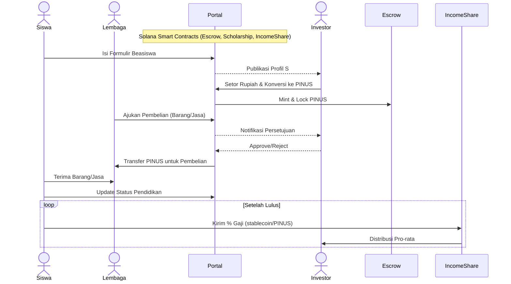

# PINUS Token Whitepaper (DRAFT)

## 1. Ringkasan Eksekutif

PINUS Token adalah aset kripto berbasis Solana (SPL) yang dirancang untuk memfasilitasi program beasiswa terdesentralisasi dan transparan antara investor dan lembaga pendidikan. Dengan memanfaatkan kecepatan, biaya transaksi rendah, dan skalabilitas Solana, PINUS menciptakan ekosistem dimana dana beasiswa dikonversi menjadi token dan dikelola melalui smart contract—menjamin penyaluran tepat guna, transparansi penggunaan, dan pembagian hasil (revenue‑sharing) bagi investor setelah penerima beasiswa lulus dan bekerja.

## 2. Latar Belakang

Pendidikan tinggi sering kali menjadi beban finansial bagi banyak siswa berbakat. Di sisi lain, filantropis dan investor mencari model pendanaan yang transparan dan terukur untuk memastikan dampak sosial nyata sekaligus potensi pengembalian investasi. Teknologi blockchain menawarkan alat untuk mendesain skema beasiswa yang:

* **Transparan**: seluruh transaksi tercatat dan dapat diaudit publik.
* **Terprogram**: syarat dan ketentuan beasiswa dijalankan otomatis oleh smart contract.
* **Scalable**: memfasilitasi ribuan hingga jutaan beasiswa tanpa beban administratif besar.

## 3. Masalah yang Ingin Diselesaikan

1. **Kurangnya Transparansi**: Donor sering tidak mengetahui bagaimana dana digunakan.
2. **Inefisiensi Administratif**: Proses manual pengajuan dan persetujuan beasiswa memakan waktu.
3. **Keberlanjutan Dana**: Tidak ada mekanisme bagi donor untuk berpartisipasi dalam keberhasilan karier penerima beasiswa.

## 4. Solusi PINUS Token

PINUS memperkenalkan **DeScholarship** — model beasiswa terdesentralisasi yang memanfaatkan PINUS Token sebagai medium nilai. Fitur utama:

* **Formulir On‑Chain**: Data pengajuan siswa di‑hash dan disimpan on‑chain/off‑chain IPFS.
* **Portal Investor**: Dashboard yang menampilkan profil siswa, prestasi, kebutuhan dana, dan parameter revenue‑sharing.
* **Escrow Token**: Dana Rupiah dikonversi menjadi PINUS Token pada portal, disimpan dalam smart contract escrow hingga disetujui penggunaannya.
* **Approval Layer**: Setiap pengeluaran (laptop, seragam, biaya kuliah) memerlukan tanda tangan digital investor.
* **Revenue Sharing**: Setelah lulus, X % gaji bulanan siswa otomatis didistribusikan ke alamat investor sesuai smart contract.

## 5. Model Beasiswa Terdesentralisasi

## 6. Arsitektur Teknis

### 6.1 Solana SPL

* **High TPS** (65k+) & biaya < US$0,01.
* Program smart contract ditulis dengan **Rust** & Anchor Framework.

### 6.2 Smart Contract Utama

| Contract                | Fungsi Utama                                                   |
| ----------------------- | -------------------------------------------------------------- |
| **ScholarshipFactory**  | Mendaftarkan lembaga & membuat instance `ScholarshipContract`. |
| **ScholarshipContract** | Menyimpan detail siswa, parameter beasiswa, escrow PINUS.      |
| **ApprovalModule**      | Multi‑sig lightweight untuk persetujuan pengeluaran.           |
| **IncomeShare**         | Mengelola pembayaran % gaji & distribusi ke investor.          |

### 6.3 Off‑Chain Layer

* **Portal Web** (Next.js/SvelteKit): UI investor & lembaga.
* **Oracle/KYC Service**: Konversi Rupiah↔PINUS via licensed exchange; verifikasi identitas.
* **IPFS/Arweave**: Penyimpanan dokumen beasiswa terenkripsi.

## 7. Alur Bisnis Detail

### 1. Pendaftaran Siswa

* Siswa mengisi form digital (data pribadi, prestasi, kebutuhan dana).
* Hash form disimpan on‑chain; dokumen terenkripsi di IPFS.

### 2. Listing di Portal Investor

* Investor dapat menelusuri & memfilter berdasarkan bidang studi, lokasi, profil risiko.

### 3. Commit Dana

* Investor menyetor IDR → Exchange → PINUS → `ScholarshipContract` escrow.

### 4. Penggunaan Dana

* Lembaga mengajukan permintaan (e.g., "Laptop 10 juta"), memicu event on‑chain.
* Investor menyetujui → PINUS ditransfer ke wallet vendor/lembaga.

### 5. Monitoring

* Dashboard menampilkan riwayat transaksi, status akademik, penyerapan dana.

### 6. Revenue Sharing

* Setelah bekerja, smart contract menarik X % gaji (dibayar mingguan/bulanan) → didistribusi otomatis.

## 8. Tokenomics

| Item              | Detail                                                                                                                      |
| ----------------- | --------------------------------------------------------------------------------------------------------------------------- |
| **Ticker**        | PINUS                                                                                                                       |
| **Standard**      | SPL Token                                                                                                                   |
| **Total Supply**  | 1,000,000,000 PINUS                                                                                                         |
| **Initial Mint**  | 30% (escrow beasiswa), 20% liquidity, 20% foundation, 15% ecosystem rewards, 10% team (36‑month vesting), 5% reserve. |
| **Exchange Rate** | Mengikuti oracle IDR↔USDC↔PINUS; update tiap blok.                                                                          |
| **Deflasi**       | 1% burn fee dari tiap revenue‑share payout untuk menjaga kelangkaan.                                                       |

## 9. Governance

* **PINUS DAO** menggunakan token staking untuk voting:
  * Parameter % revenue share.
  * Persetujuan lembaga baru.
  * Penggunaan dana foundation.

## 10. Legal & Kepatuhan

* KYC/AML pada investor & siswa.
* Kepatuhan OJK terkait securities & crowdfunding.
* Integrasi licensed exchange untuk on/off‑ramp Rupiah.

## 11. Keamanan

* Audit independen smart contract.
* Bug bounty via Immunefi.
* Cold storage & multisig untuk treasury.

## 12. Roadmap

| Q       | Target                                                 |
| ------- | ------------------------------------------------------ |
| Q3 2025 | MVP Portal, mint PINUS, pilot 3 lembaga pendidikan     |
| Q4 2025 | Integrasi Rupiah on‑ramp, audit smart contract v1      |
| Q1 2026 | Launch DAO governance, 100 beasiswa aktif              |
| Q3 2026 | Revenue‑share module produksi, ekspansi regional ASEAN |

## 13. Tim & Mitra

* **Founders**: Lukluk Santoso (VP Engineering, Banking), \<nama‑nama lain>.
* **Advisors**: Ahli pendidikan, legal fintech, blockchain.
* **Partners**: Exchange berlisensi, lembaga pendidikan terakreditasi, vendor laptop.

## 14. Risiko

1. **Regulasi**: Perubahan aturan kripto Indonesia.
2. **Teknis**: Congestion jaringan Solana.
3. **Pasar**: Volatilitas harga PINUS vs IDR.
4. **SDM**: Dropout siswa atau gagal bayar revenue‑share.

## 15. Kesimpulan

PINUS Token menghadirkan solusi terukur dan transparan dalam mendanai pendidikan melalui blockchain Solana. Dengan menggabungkan smart contract escrow, approval pengeluaran, dan revenue‑sharing otomatis, ekosistem ini memastikan dana beasiswa dimanfaatkan tepat sasaran sekaligus memberi insentif ekonomi berkelanjutan bagi investor.

> *Dokumen ini bersifat draf dan dapat berubah seiring proses audit, masukan komunitas, dan perkembangan regulasi.*
